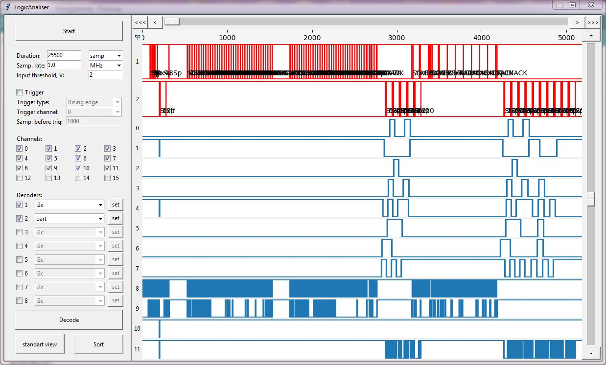
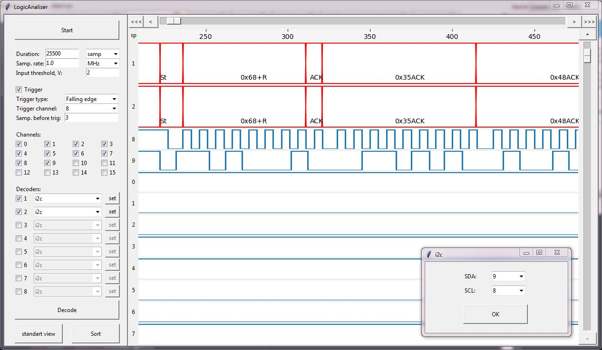

# Logic_Analyzer_User_Interface
User interface for logic analyser. Made in Python  

LogAn.py - main file with i2c default decoder  
la_uart.py - dynamicaly loaded uart decoder  
la_spi.py - dynamicaly loaded spi decoder  
  
Screenshots:
  

